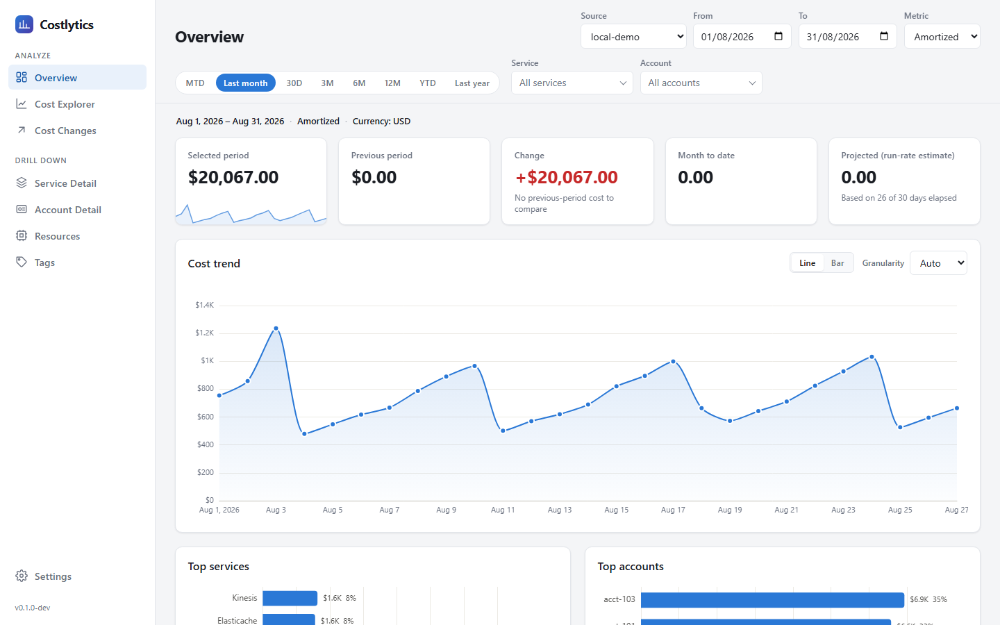
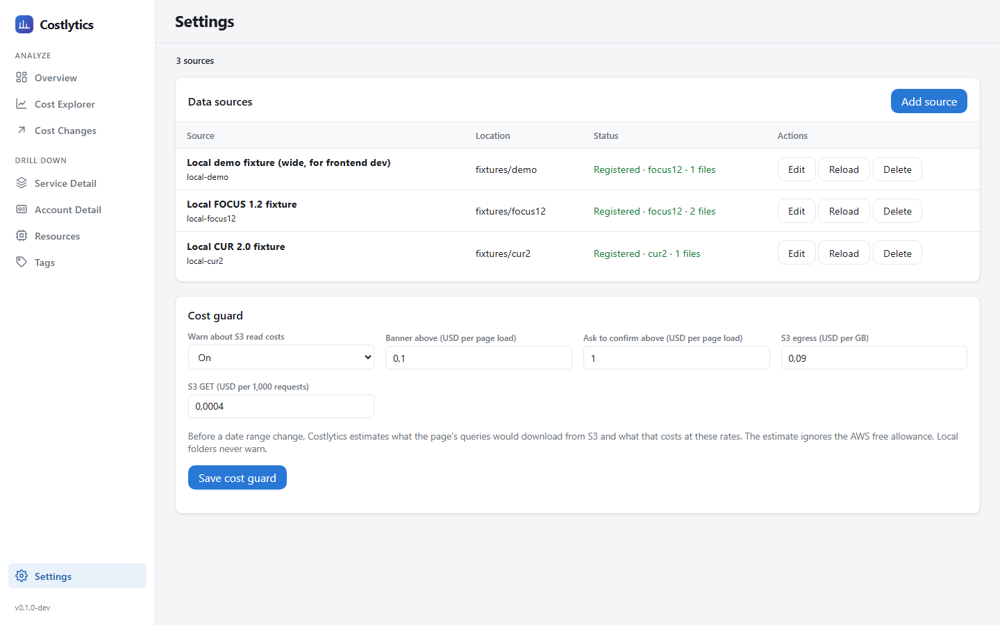
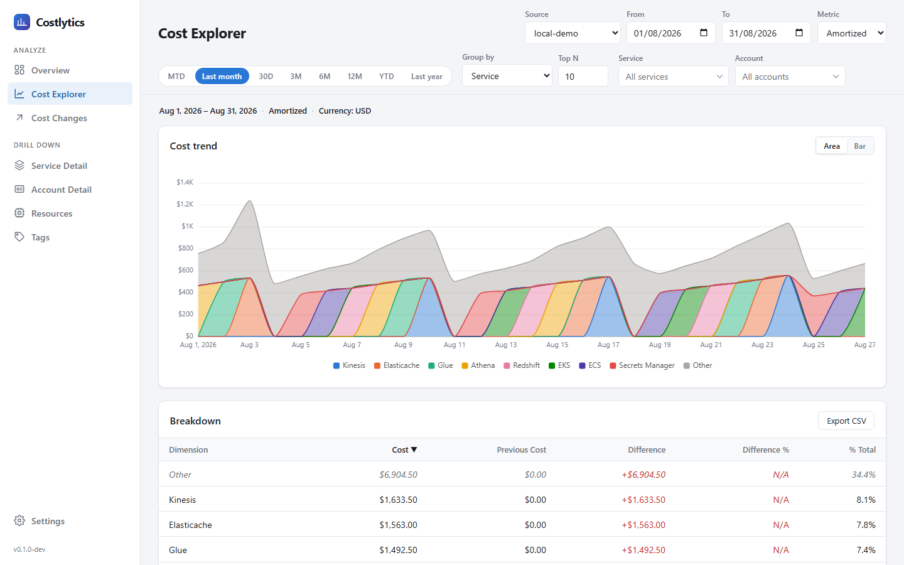
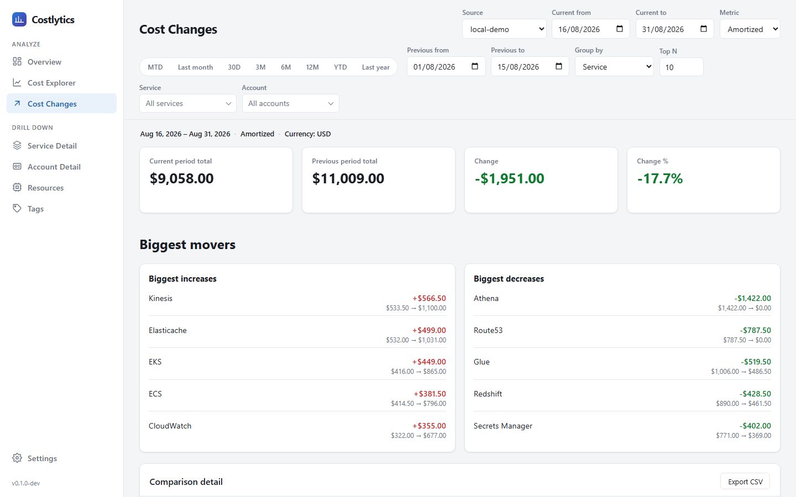
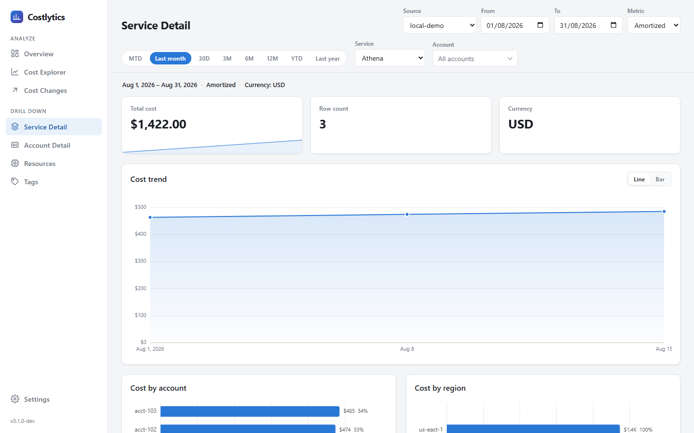
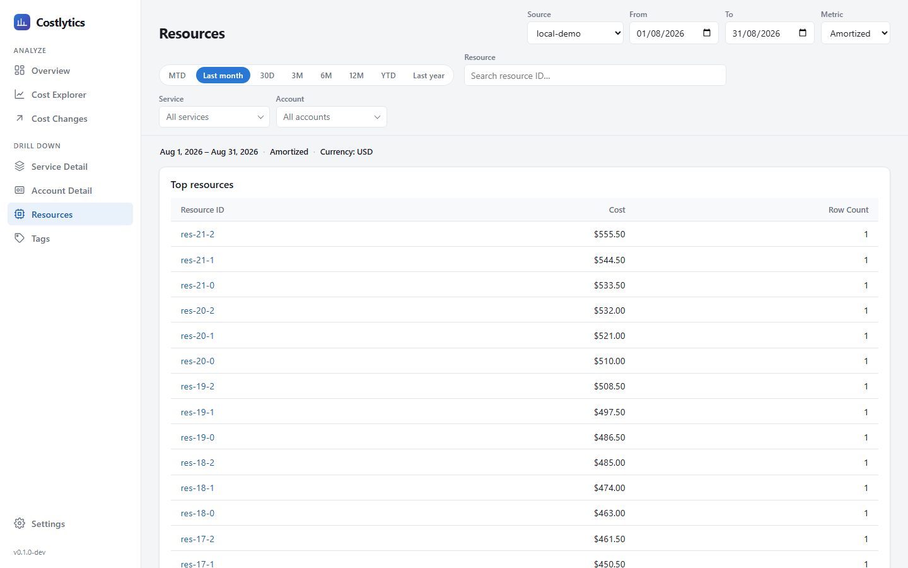
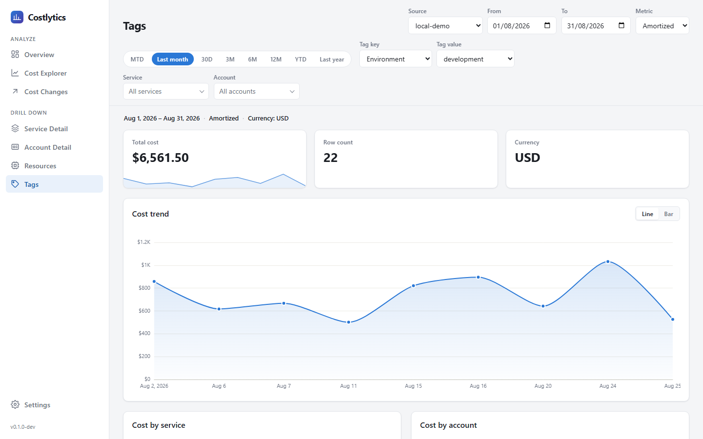

# Costlytics

[](LICENSE)
[](https://github.com/tero-k/costlytics/tags)


Costlytics is a desktop app for Windows and macOS for exploring your AWS
costs. Point it at your AWS billing exports (FOCUS 1.0, FOCUS 1.2 or CUR 2.0,
in Parquet) in an S3 bucket or a local folder. It queries them in place with
an embedded DuckDB engine: no server to run, no database to load, and no
third-party service between you and your billing data.



## Features

- **Overview dashboard**: the period total, the change against the previous
  period, month to date, a run-rate projection, the cost trend, and your top
  services and accounts.
- **Cost Explorer**: group cost by service, account, region, availability
  zone, charge category, pricing category or resource, with period-over-period
  comparison and CSV export.
- **Cost Changes**: compare any two periods and see the biggest increases and
  decreases.
- **Drill-downs**: per-service, per-account, per-resource and per-tag pages.
- **Four cost metrics**: amortized, billed, list and contracted.
- **Several data sources**: add as many S3 or local sources as you like and
  switch between them. S3 credentials are kept in the OS keychain.
- **Cost guard**: warns before a query would read an expensive amount of data
  from S3.
- **Shareable views**: the date range, metric, source and filters are all in
  the URL.

## Contents

- [Installation](#installation)
- [Connecting your billing data](#connecting-your-billing-data)
- [Using Costlytics](#using-costlytics)
- [Development](#development)
- [Versioning & releasing](#versioning--releasing)
- [Contributing](#contributing)
- [License](#license)

## Installation

There are no prebuilt downloads yet, so you build Costlytics from source.

**Prerequisites**

- Rust stable ([rustup](https://rustup.rs/)). `rust-toolchain.toml` pins the
  stable channel.
- Node.js 22 LTS (20.19 or newer also works).
- Tauri CLI 2: `cargo install tauri-cli --version "^2"`.
- Windows: WebView2, which is preinstalled on Windows 11. macOS: the Xcode
  Command Line Tools.

**Build and run**

```
git clone https://github.com/tero-k/costlytics.git
cd costlytics
cd web && npm ci && cd ..
cd crates/app
cargo tauri dev      # run in development mode
cargo tauri build    # or build an installer
```

`cargo tauri build` writes installers to `target/release/bundle/`: `msi` and
`nsis` on Windows, `dmg` and `macos` on macOS. A macOS bundle must be built on
a Mac. Local builds are unsigned; the signed and notarized DMGs attached to
releases are built by the `macOS` GitHub Actions workflow
(`.github/workflows/macos.yml`) when a `vX.Y.Z` tag is pushed.

Settings are stored in `settings.toml` in the app config directory
(`%APPDATA%\app.costlytics.desktop\` on Windows,
`~/Library/Application Support/app.costlytics.desktop/` on macOS), or
wherever the `COSTLYTICS_CONFIG` environment variable points.

## Connecting your billing data

### Exporting from AWS

In the AWS console, go to **Billing and Cost Management → Data Exports** and
create an export of type **FOCUS** or **Standard data export (CUR 2.0)**,
with **Parquet** as the file format and an S3 bucket as the destination. AWS
delivers the first data within about 24 hours and refreshes it daily after
that.

### Expected layout

Costlytics expects one folder per billing month under a common base folder:

```
<base>/
  BILLING_PERIOD=2026-07/
    Manifest.json        (optional)
    *.parquet
  BILLING_PERIOD=2026-08/
    ...
```

- For AWS Data Exports the base is `s3://<bucket>/<prefix>/<export-name>/data`.
- A local source uses the same layout, for example a folder you synced with
  `aws s3 sync`.
- The `Manifest.json` in each month is optional. Without it, Costlytics reads
  the Parquet files in that folder directly.
- The folder name is matched case-insensitively, so `billing_period=2026-07/`
  works too. If a month exists in both spellings, both are read and a warning
  is logged. Remove the duplicate, or that month is counted twice.
- The format is auto-detected from the Parquet schema, or you can set it when
  you add the source.

### S3 access

- **Authentication**: either **AWS profile / credential chain** (environment
  variables, `~/.aws`, SSO), or an **access key**. The secret key goes into
  Windows Credential Manager or the macOS Keychain, never into
  `settings.toml`.
- **IAM permissions**: `s3:ListBucket` on the bucket (it can be limited to the
  prefix) and `s3:GetObject` on the prefix.
- The first time you use S3, DuckDB downloads its `httpfs` and `aws`
  extensions. This needs network access, and the extensions are cached in
  `~/.duckdb/extensions`.
- Data is queried in place using HTTPS range reads and is never copied to
  disk. S3 queries are slower than local ones.

### Cost guard

Reading from S3 costs money (egress and GET requests), and a wide date range
can pull many gigabytes on every page load. When a source is registered,
Costlytics indexes the Parquet footers: row-group sizes and date statistics
(see `crates/data/src/scan_index.rs`). Before a date-range or source change
re-runs a page's queries, it estimates the bytes, the number of requests and
the dollar cost of that page load.

- **Above the banner limit** (default $0.10), the page loads and shows a
  warning banner.
- **Above the confirm limit** (default $1.00), the page asks before loading.
  Cancelling restores the previous range. Once you confirm a selection, you
  aren't asked again for it in the same session.

You set the limits and rates under **Settings → Cost guard**. The default
rates are $0.09 per GB of egress and $0.0004 per 1,000 GET requests, and the
estimate ignores the AWS free allowance. They are stored as `[cost_guard]` in
`settings.toml`.

Local folders never trigger a warning. The estimate follows DuckDB's own
pruning: it counts only the row groups whose date statistics overlap the
range, and only the columns a typical query reads. It is an approximation,
and it shows "up to" when files lack date statistics. If no estimate is
available, the page loads as usual.

## Using Costlytics

### Getting started

1. Open **Settings** and click **Add source**.
2. Choose **S3 bucket** or **Local folder** (local folders have a
   **Browse…** button). Give the source a name, and leave the format on
   **Auto-detect** unless you need to set it.
3. For S3, choose how to authenticate, then click **Test connection**.
4. Click **Save**. The source shows **Registered** with its format and file
   count once it has loaded. If it can't be loaded, it shows the reason.
5. Go to **Overview**. If you have more than one source, pick one from the
   **Source** dropdown.



### Controls shared by every page

- **Source**: the data source to query.
- **From / To**: the date range. The chips (**MTD**, **Last month**, **30D**,
  **3M**, **6M**, **12M**, **YTD**, **Last year**) set common ranges in one
  click.
- **Metric**: which cost to sum.
  - **Amortized**: upfront commitments (Savings Plans, Reserved Instances)
    spread over the period they cover.
  - **Billed**: what appears on the invoice.
  - **List**: the public on-demand price.
  - **Contracted**: the price after negotiated discounts. This is FOCUS only,
    since CUR 2.0 has no contracted cost.
- **Service / Account filters**: narrow the page to selected services or
  accounts. Each page remembers its own filters.
- **Status bar**: shows the active range, metric, currency and filters.

The date range, metric and source stay the same as you move between pages.
Everything is also in the URL, so you can bookmark a view.

### Pages

**Overview**: the headline numbers for the selected range. You see the
period's total, the previous period of the same length, the change between
them, month to date, and a run-rate projection for the current month. Below
them are the cost trend (line or bar, by day, month or year) and your top
services and accounts.

**Cost Explorer**: slice cost by any dimension. Choose **Group by** and
**Top N**. The stacked trend shows the largest groups, with the rest gathered
into **Other**. The **Breakdown** table compares each group with the previous
period. Click a column header to sort it, and use **Export CSV** to download
the table.



**Cost Changes**: find out what made costs go up or down. Set the current
and previous periods independently, for example this month against the same
month last year. The page shows both totals, the biggest increases and
decreases, and a sortable comparison table that you can export as CSV.



**Service Detail / Account Detail**: pick one service or account to see its
total, its trend and its most expensive resources. Service Detail breaks the
cost down by account, region and charge category. Account Detail breaks it
down by service and region.



**Resources**: your most expensive individual resources. Type in **Search
resource ID** to find a specific one. Click a resource to see its cost trend
and its cost by charge category, pricing category and region.



**Tags**: cost attribution by tag. Choose a **Tag key** (for example
`Environment` or `Team`) and a **Tag value** to see that slice's total, its
trend, and its cost by service, account and region.



**Settings**: add, edit, reload or delete data sources, and configure the
[cost guard](#cost-guard).

The app version is shown at the bottom of the sidebar. Hover over it to see
the exact build.

## Development

### Project layout

| Path | What it is |
| --- | --- |
| `crates/domain` | Shared types: cost records, dimensions, filters |
| `crates/data` | DuckDB access, partition discovery, schema detection, the FOCUS 1.0 / 1.2 and CUR 2.0 adapters, queries, the S3 scan index, and the fixture generator |
| `crates/service` | Transport-agnostic backend: request validation, cost queries, the source registry, settings and secrets |
| `crates/app` | The Tauri 2 desktop app. It calls `service` in process through Tauri commands |
| `crates/api` | Dev/test HTTP harness (Axum, binary `costlytics-api`). It serves the same `service` code over `/api/v1/*` and is not shipped in the app |
| `web/` | Frontend: TypeScript, Vite and ECharts, one HTML entry point per page |
| `config/example.toml` | Settings file for the harness, pointing at the fixtures |

The root `cargo build` and `cargo test` skip the desktop app crate, which is
slow to build and needs the WebView toolchains. Use `--workspace` to include
it.

### Sample data

Real billing data is never committed. `fixtures/` is gitignored, and you
generate the synthetic datasets with:

```
cargo run -p data --bin generate-fixtures
```

This creates `fixtures/focus12/` (FOCUS 1.2), `fixtures/cur2/` (CUR 2.0) and
`fixtures/demo/`. `demo` is a wider FOCUS 1.2 set with 22 services, 3 accounts
and some untagged rows, for trying out the UI. All three cover August 2026.

### Running in the browser

Instead of the desktop app, you can run the frontend in a browser against the
HTTP harness. The harness reads `COSTLYTICS_CONFIG` (default
`config/example.toml`), which registers the three fixture sources.

```
cargo run -p api          # backend on http://127.0.0.1:3000
cd web && npm run dev     # frontend on http://localhost:5173, proxies /api
```

On Windows, `run-local.ps1` runs an optimized build the same way. The backend
listens on :3000 and `vite preview` serves the frontend on :4173. The script
uses a scratch copy of the config (`target/local-settings.toml`), so changes
you make in Settings don't touch `config/example.toml`.

```
.\run-local.ps1 -Build    # build backend, fixtures and frontend, then run
.\run-local.ps1           # run the existing build
```

`GET /api/v1/sources` shows the harness's view of each source. For each
configured source it returns the state: `pending` (registration still
running), `registered` (with the detected format and file count) or `skipped`
(with the reason). It also returns `default_source_id`, the source used when a
request doesn't name one.

To try the cost guard against local fixtures, start the harness with
`COSTLYTICS_COST_GUARD_TREAT_LOCAL_AS_REMOTE=1` and set very low limits in
Settings.

### Tests

```
cargo test --workspace                              # all Rust tests
cargo test -p api --test http_integration           # end-to-end: discovery → schema detection → HTTP query
cd web && npm test                                  # Vitest unit tests for web/src/shared
cd web && npm run test:e2e                          # Playwright end-to-end suite
```

- **Playwright suite**: it regenerates the fixtures, then starts the harness
  on a scratch copy of the config (`target/e2e-settings.toml`) and the Vite
  dev server. It covers page smoke checks, source, entity and tag switching,
  comparison-table sorting and CSV export, Settings source management, and
  failure isolation. The first run needs `npx playwright install chromium`.
- **Stale backend**: if something is already listening on port 3000, the
  suite reuses it and skips regenerating the fixtures. Stop any old
  `cargo run -p api` first so you test the current code.
- **Manual S3 acceptance test**: this one needs a real bucket.

  ```
  COSTLYTICS_S3_TEST_URI=s3://… cargo test -p service -- --ignored real_s3
  ```

## Versioning & releasing

Costlytics uses [SemVer](https://semver.org/) and stays on `0.x` until the
data model and API settle. Bump the minor version (`0.MINOR.0`) for new
features or breaking changes, and the patch version (`0.x.PATCH`) for fixes.

The version is defined in one place: `[workspace.package] version` in the
root `Cargo.toml`. Everything else follows it:

- every crate inherits it;
- the desktop installer uses it, so `tauri.conf.json` has no `version`;
- `GET /api/v1/health` reports it;
- `web/vite.config.ts` injects it into the frontend at build time.

The `version` in `web/package.json` isn't used. The sidebar shows `vX.Y.Z`,
with `-dev` added when the frontend is served by `npm run dev`. Its tooltip
shows the build id from `git describe --tags --always --dirty`.

To cut a release:

1. Bump `version` under `[workspace.package]` in `Cargo.toml` and run
   `cargo check --workspace` to refresh `Cargo.lock`.
2. In `CHANGELOG.md`, move the `Unreleased` entries under
   `## [X.Y.Z] - YYYY-MM-DD`.
3. Commit with `git commit -am "chore(release): vX.Y.Z"`, then run
   `git tag -a vX.Y.Z -m "vX.Y.Z"` and `git push --follow-tags`.
4. Build the installer with `cargo tauri build`.

See [CHANGELOG.md](CHANGELOG.md) for the release history.

## Contributing

Issues and pull requests are welcome.

- **Bugs and feature requests**: open an
  [issue](https://github.com/tero-k/costlytics/issues). For a bug, include
  the app version from the bottom of the sidebar (hover over it for the exact
  build), your OS, and the export format (FOCUS 1.0, FOCUS 1.2 or CUR 2.0).
- **Pull requests**: branch from `main` and keep each PR to one change.
  Write commit messages in
  [Conventional Commits](https://www.conventionalcommits.org/) style
  (`feat(web): …`, `fix(data): …`, `docs: …`). Add a line under `Unreleased`
  in `CHANGELOG.md` for any change a user would notice.
- **Checks before a PR**: the repository has no CI, so run the checks
  yourself and include the results in the PR:

  ```
  cargo test --workspace
  cargo clippy --workspace --all-targets
  cd web && npm test && npx tsc --noEmit && npm run test:e2e
  ```

- **Never commit real billing data or credentials.** Use the synthetic
  fixtures for tests and screenshots.

## License

Costlytics is released under the [MIT License](LICENSE).
